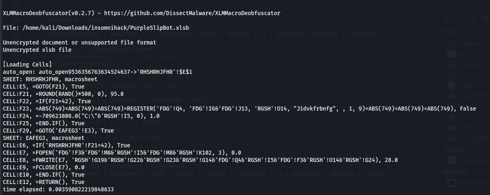
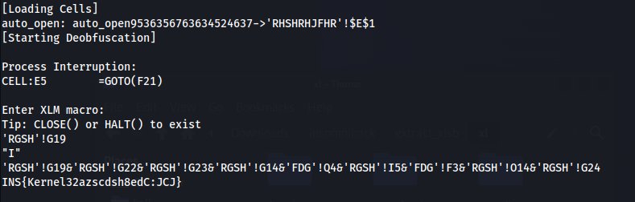

1. On obtient un fichier xlsb, c'est un classeur de macro, petite particularité les macros sont compilé donc olevba ne peut pas les récupérer
2. Première chose à faire : extraire le fichier pour obtenir les binaires
3. Lancer la commande **xxd** sur le fichier sharedStrings.bin pour obtenir l'easter egg
4. Utiliser l'outil **xlmdeobfuscator** sur le fichier xlsb :

```
xlmdeobfuscator -x -f PurpleSlipBot.xlsb
```

5. On obtient ceci :



6. On remarque que la macro va écrire dans la cellule E8
7. On va réutiliser l'outil xlmdeobfuscator mais cette fois en mode "shell"/"interactif", il nous suffit de récupérer la concaténation des lettres qu'il écrit dans la cellule E8 pour obtenir le flag :



# Quelques précision et liens
Ce fichier est un fichier utilisé par **Qakbot**, avant quakbot était appelé purple slip bot

Liens qui m'ont permis de résoudre le challenge :
- https://www.virusbulletin.com/virusbulletin/2021/02/excel-formulamacro-xlsb/
- https://www.hornetsecurity.com/en/threat-research/qakbot-distributed-by-xlsb-files/
- https://isc.sans.edu/diary/XLSB+Files+Because+Binary+is+Stealthier+Than+XML/28476