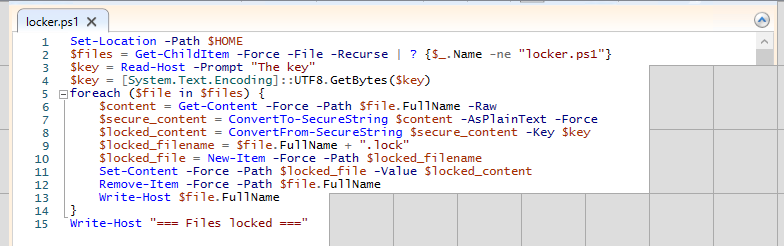
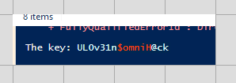

1. On a un dossier avec les documents chiffrés de l'utilisateur et un dossier qui est le résultat de l'exécution de Kape
2. Après avoir analysé $MFT, $Secure_$SDS, $Boot, $recycle_bin, les amcaches, etc. On remarque que l'utilisateur **User1** a exécuté un script nommé **locker.ps1**, mais le seul artefact qui nous est utile pour récupérer le flag c'est les caches RDP
3. On va utiliser l'outil de l'ANSSI **bmc-tools** qui va nous permettre de récupérer plein de .png extrait des caches RDP
4. Ensuite on utilise **RdpCacheStitcher** pour reconstruitre le script et le shell dans lequel l'utilisateur entre la clef. On obtient quelque chose comme ça :




5. Pour finir nous écrivons un petit script pour déchiffrer :

```
$files = Get-ChildItem -Force -File -Recurse | ? {$_.Name -ne "unlocker.ps1"}
$key = Read-Host -Prompt "Key : "
$key = [System.text.Encoding]::UTF8.GetBytes($key)
foreach ($file in $files) {
    $encrypted_content = Get-Content -Force -Path $file.FullName -Raw
    
    # create new object using $encrypted and $aeskey
    $secureObject = ConvertTo-SecureString -String $encrypted_content -Key $key
 
    # perform decryption from secure object
    $decrypted = [System.Runtime.InteropServices.Marshal]::SecureStringToBSTR($secureObject)
    $decrypted = [System.Runtime.InteropServices.Marshal]::PtrToStringAuto($decrypted)
    $decrypted
}
```

